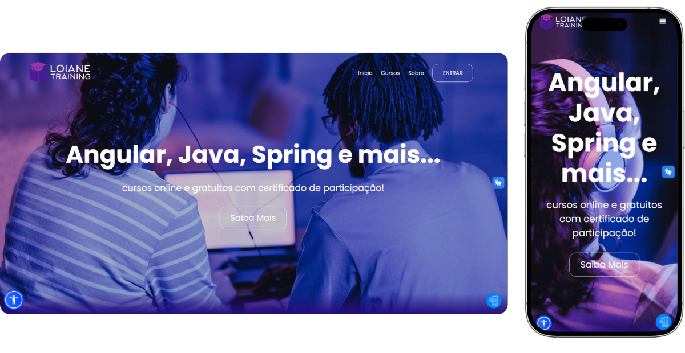

# 🎓TCC IOS - Redesign Loiane Training | Códice 

Este projeto é um **redesign da plataforma Loiane Training**, desenvolvido pela consultoria fictícia **Códice**, com o objetivo de melhorar a experiência dos usuários, modernizar a identidade visual da plataforma e destacar a excelência dos cursos oferecidos por **Loiane Groner**.

## 🚀 Objetivo

Modernizar o site da Loiane Training com foco em:

- Usabilidade e acessibilidade
- Organização visual dos cursos
- Clareza na navegação e hierarquia da informação
- Interface responsiva (desktop e mobile)
- Valorização da marca pessoal da Loiane

---

## 🧠 Sobre a Loiane Training

A Loiane Training é uma plataforma educacional que oferece cursos gratuitos e pagos em áreas como:

- Desenvolvimento Web
- Java
- Angular
- Spring Boot
- Ext JS

Criada por **Loiane Groner**, desenvolvedora experiente e referência em ensino de tecnologia.

---

## 🖌️ O que foi redesenhado?

- **Home Page** com valor de marca, destaque para cursos e chamada para ação
- **Seção de Cursos** com categorias e ícones personalizados
- **Página de Depoimentos** com feedbacks reais de alunos fictícios
- **Design Responsivo** para dispositivos móveis
- **Nova Identidade Visual**, moderna e funcional

---

## 🎨 Tecnologias utilizadas

- HTML5  
- CSS3  
- JavaScript (básico)  
- Google Fonts  
- Layout responsivo com media queries

---

## 🧩 Quem somos — Códice

**Códice** é uma consultoria criativa (fictícia) especializada em **rebranding e redesign de marcas e sites**. Nosso foco é transformar a presença digital de empresas por meio de design funcional, acessível e impactante.

🔹 Missão: Tornar a tecnologia mais acessível, humana e inteligente  
🔹 Visão: Ser referência em transformação digital com propósito  
🔹 Valores: Inovação, simplicidade, impacto, ética e inclusão

---

## 👩‍💻 Acesse o projeto

🔗 [Clique aqui para visualizar o site ao vivo](https://dani3llla.github.io/Website-loiane-training/)

---

## 📸 Prévia do projeto

 

---

## 📬 Contato

Em caso de dúvidas ou sugestões, entre em contato com a equipe Códice.  
Vamos adorar trocar ideias com você! 💬

---

> Projeto acadêmico sem fins lucrativos, criado com fins educacionais e demonstração de redesign.
